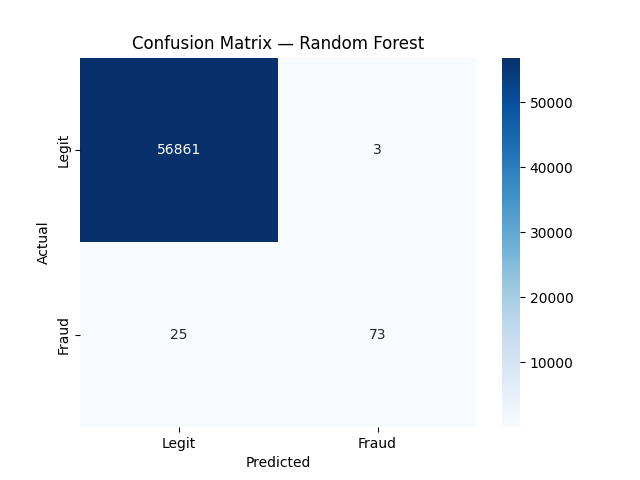

# 💳 Credit Card Fraud Detection

Detecting fraudulent credit card transactions using the real-world ULB dataset.
Addressed class imbalance (99.8% legit vs 0.2% fraud) using balanced class weights.

## 📊 Model Results

| Model | ROC-AUC | Precision (Fraud) | Recall (Fraud) |
|---|---|---|---|
| Logistic Regression | 0.97 | 0.06 | 0.92 |
| Random Forest | 0.95 | 0.96 | 0.74 |

## 🔍 Key Findings

In fraud detection, **recall matters more than precision** — missing real fraud
is costlier than a false alarm. Logistic Regression's recall of 0.92 makes it
preferable for production use despite low precision. Random Forest is useful
when false alarms need to be minimized (precision = 0.96).

## 📈 Confusion Matrix (Random Forest)

- ✅ 56,861 legit transactions correctly identified
- ✅ 73 frauds correctly caught
- ❌ 25 frauds missed (false negatives)
- ⚠️ 3 false alarms (false positives)

## 🛠️ Tech Stack
Python | scikit-learn | Pandas | Matplotlib | Seaborn | NumPy

## 📁 How to Run
1. Download `creditcard.csv` from [Kaggle](https://www.kaggle.com/datasets/mlg-ulb/creditcardfraud)
2. Open `fraud_detection.ipynb` in Jupyter or Google Colab
3. Update the CSV path in the load cell
4. Run all cells

## 📁 Dataset
- 284,807 transactions | 492 fraud cases (0.17%)
- Features V1–V28 are PCA-transformed for confidentiality
- Source: ULB Machine Learning Group